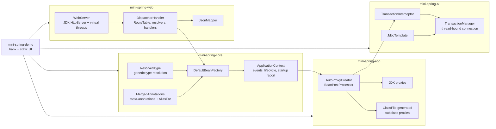

# mini-spring

A dependency injection container, an AOP layer with generated class proxies, JDBC transactions and an MVC dispatcher with its own JSON reader and writer, written from scratch on the JDK alone (Java 25, no runtime dependencies in the framework modules). It exists to show what Spring does underneath: generics-aware bean resolution, `BeanPostProcessor`-based proxying, `@Transactional` propagation and rollback rules, and request routing. A small bank application in `mini-spring-demo` uses all of it.

[](https://github.com/mgeladzerezo/mini-spring/actions/workflows/ci.yml)

> **CI result.** On 7 October 2026 the workflow ran the complete suite on GitHub Actions (Ubuntu, Docker available) and it passed: 342 tests across the five modules, 0 failures ([run 37606161278](https://github.com/mgeladzerezo/mini-spring/actions/runs/37606161278)). The verification notes further down describe what had been run on this machine before that and are kept for the record.

## Architecture



| Module | Contents |
|---|---|
| `mini-spring-core` | scanning, annotations, container, generics, environment, conversion, events, conditions, startup report |
| `mini-spring-aop` | `MethodInterceptor` chains, JDK and generated-subclass proxies, `@Timed`, `@Retry`, `AutoProxyCreator` |
| `mini-spring-tx` | `@Transactional`, `TransactionManager`, `JdbcTemplate` |
| `mini-spring-web` | embedded HTTP server, MVC dispatcher, argument resolvers, return value handlers, JSON |
| `mini-spring-demo` | a bank: generic repositories, transactional transfer, events, advice, interceptor, UI, benchmark |

## Quick start

```
docker compose up --build
```

then open <http://localhost:8202>. Make a transfer, then try an amount larger than the balance (422, nothing changes) and a transfer to account 999 (404: the debit already executed is rolled back). The "Container" tab shows the bean graph with creation times, the route table, and the timings recorded by `@Timed`.

Without Docker: `./mvnw -B verify`, then `java -jar mini-spring-demo/target/mini-spring-demo.jar` (needs JDK 25; the dependencies are in `target/lib`). The container prints a bean graph and phase timings on startup.

## Spring feature to implementation

| Spring feature | How mini-spring implements it | File |
|---|---|---|
| Component scanning | hand-written class path walk over directories and jars, reads annotations on loaded classes | `core/scan/ClassPathScanner.java` |
| Stereotypes and meta-annotations, `@AliasFor` | breadth-first walk of the annotation graph, synthesised annotation proxies for forwarded attributes | `core/annotation/MergedAnnotations.java` |
| Generic type resolution (`Repository<User>`) | `ResolvedType` binds type variables through superclasses and interfaces, with wildcard containment rules | `core/type/ResolvedType.java` |
| `ApplicationContext` / `BeanFactory` | creation, constructor/field/setter injection, scopes, lazy, qualifiers, primary, ordered shutdown | `core/beans/DefaultBeanFactory.java`, `core/context/ApplicationContext.java` |
| Circular dependency errors | creation path stack, error prints `A -> B -> C -> A` | `core/beans/CircularDependencyException.java` |
| `@Value`, `Environment` | property sources with precedence, nested placeholders, `ConversionService` targets a `ResolvedType` | `core/env/`, `core/convert/ConversionService.java` |
| `BeanPostProcessor` | three hooks; one of them (`determineInstantiationClass`) exists so class proxies need no second instance | `core/beans/BeanPostProcessor.java` |
| Application events, `@EventListener` | multicaster; listeners filtered by the generic event type | `core/event/` |
| `@Profile`, `@ConditionalOnProperty` | `Condition` evaluated while reading definitions | `core/condition/` |
| AOP proxying (`AbstractAutoProxyCreator`) | `AutoProxyCreator` is a `BeanPostProcessor`; advisors are beans | `aop/AutoProxyCreator.java` |
| JDK dynamic proxies | `java.lang.reflect.Proxy` around a target | `aop/proxy/JdkProxyHandler.java` |
| CGLIB subclass proxies | bytecode generated with `java.lang.classfile` | `aop/proxy/SubclassProxyGenerator.java` |
| `@Transactional` | interceptor over `TransactionManager`; propagation, isolation, read-only, rollback rules | `tx/TransactionManager.java`, `tx/TransactionInterceptor.java` |
| `TransactionSynchronizationManager` | `ThreadLocal` map of data source to connection holder | `tx/TransactionContext.java` |
| `JdbcTemplate` | joins the thread's connection or uses a throwaway auto-commit one | `tx/JdbcTemplate.java` |
| `@Retry`/`@Timed` (the second aspect) | two more advisors, no framework change | `aop/aspects/` |
| `DispatcherServlet` | `DispatcherHandler.handle` | `web/mvc/DispatcherHandler.java` |
| `HandlerMapping`, `PathPattern` | `RouteTable` with specificity ordering and 404/405/415 | `web/mvc/RouteTable.java`, `web/mvc/PathPattern.java` |
| `HandlerMethodArgumentResolver` | strategy interface; built-ins for path, query, header, body, request | `web/mvc/HandlerMethodArgumentResolver.java` |
| `HandlerMethodReturnValueHandler` | strategy interface; `ResponseEntity` and body handlers built in | `web/mvc/ReturnValueHandler.java` |
| `@ExceptionHandler`, `@ControllerAdvice` | closest exception type wins, controller before advice | `web/mvc/ExceptionResolver.java` |
| `HandlerInterceptor` | `preHandle` in order, `afterCompletion` in reverse | `web/mvc/HandlerInterceptor.java` |
| Jackson | strict parser, runtime-type writer, binder over `ResolvedType` | `web/json/` |
| Embedded server | `com.sun.net.httpserver` with a virtual thread per request | `web/http/WebServer.java` |

## From `MiniApplication.run()` to a handled request

1. `MiniApplication.run(BankApplication.class)` builds an `ApplicationContext`: it registers the class (so `@EnableAspects`, `@EnableTransactionManagement`, `@EnableWebMvc` are read; each is only an `@Import` of a configuration class) and scans its package.
2. The `BeanDefinitionReader` turns classes and `@Bean` methods into definitions, evaluating conditions. A bean's injectable type is its declared generic type, so `@Bean Repository<Order, Long> orders()` is injectable as exactly that.
3. `BeanPostProcessor` beans are created first. `AutoProxyCreator` collects every `Advisor` bean, which includes the transaction advisor.
4. Singletons are created. For a class like `TransferService` the creator asks which methods advisors match (`@Retry`, `@Timed`, `@Transactional`). Nothing is on an interface, so the plan is a subclass proxy: before the constructor runs, the container is told to instantiate a generated subclass instead, with the same constructor arguments injected. Advice is switched on only after `@PostConstruct`.
5. `Lifecycle` beans start. `WebServer.start()` first runs `DispatcherHandler.initialize()`: it scans the container for controllers, builds the route table, picks one argument resolver per parameter and fails startup for ambiguous mappings, parameters nobody can resolve, or a `@PathVariable` name the pattern does not have. Then it binds the port.
6. A request arrives on a virtual thread. `RouteTable.lookup` decides: no path match (static file or 404), wrong method (405 with `Allow`), wrong content type (415), otherwise the most specific pattern.
7. Interceptors run `preHandle`; resolvers produce the arguments (`@RequestBody List<OrderDto>` is bound using the parameter's generic type); the controller method runs; the first `ReturnValueHandler` that supports the value writes the response.
8. A thrown exception goes to `@ExceptionHandler` methods (controller first, then advice, closest type wins), else to the default JSON error. `afterCompletion` runs in reverse order; the server writes the response.

## Hard problems and how the code solves them

**Generics-aware resolution.** Erasure removes type arguments from objects, not from declarations. `ResolvedType` reads declarations and connects them: `forClass(UserRepository.class).as(Repository.class)` walks the generic superclass and interfaces and carries bindings along. Members are resolved in the context of the concrete class they are used from, which is how a handler `T save(@RequestBody T entity)` inherited from `CrudController<T, ID>` sees `Product` when called on `ProductController extends CrudController<Product, Long>`. The container, the JSON binder and the web layer all use this one class. An unbound type variable is an "unresolved variable" that matches with an unchecked result rather than a hard yes or no. Tests: `ResolvedTypeTest`, `GenericInjectionTest`, `JsonMapperTest`, `MvcTest`.

**Generated class proxies.** `SubclassProxyGenerator` builds a subclass with the `java.lang.classfile` API (final in Java 24). It emits one constructor per accessible superclass constructor, one override per advised method with boxing and unboxing spelled out for primitives and `long`/`double` slots, `ExceptionsAttribute` for checked exceptions, and a `invokeSuper` bridge that calls the original with `invokespecial`, so call-through needs no reflection. `final`, `static` and private advised methods and `final` classes cannot be overridden: `ProxyPlan` detects them up front and reports all obstacles in one `ProxyCreationException` rather than silently skipping advice. Instances are created by the container, so injection applies to the proxy instance itself. Tests: `SubclassProxyTest` (26 cases for awkward signatures), `AutoProxyCreatorTest`.

**Transactions.** `TransactionManager.begin` implements the propagation table documented in its Javadoc: joining shares one connection and one rollback-only flag; `REQUIRES_NEW` unbinds the outer holder, binds a second connection and rebinds the outer one afterwards. Only the method that started a transaction commits or rolls back physically, so an inner failure that the outer method swallows produces an `UnexpectedRollbackException` at the outer commit instead of a silent partial commit. Rollback rules pick the rule closest to the thrown exception in the class hierarchy. Tests: `PropagationMatrixTest` (27 scenarios against H2, expected rows written out by hand), `DeclarativeTransactionTest`.

**Self-invocation.** A call from one method to another on `this` does not cross the proxy. With an interface (JDK) proxy the target is a separate object, so the advice is skipped: `selfInvocationThroughAnInterfaceProxyBypassesTheTransaction` demonstrates it. With the generated subclass the instance *is* the proxy, so `this.method()` is virtual dispatch into the generated override and the advice does run (`aGeneratedSubclassProxyDoesInterceptSelfInvocationBecauseThisIsTheProxy`). This differs from Spring's CGLIB proxies, which delegate to a separate target and therefore have the pitfall too.

## Design decisions

- **Constructor cycles are rejected, not papered over.** Spring supports setter/field cycles by exposing half-built singletons ("early references"). That hides a design problem and interacts badly with proxies (the early reference may need to be replaced by a proxy after other beans captured it). Here every cycle is an error that prints its path (`A -> B -> C -> A`).
- **No `@Configuration` subclassing.** Spring proxies configuration classes so that calling one `@Bean` method from another returns the singleton. Here a dependency between factory methods is a method parameter. One fewer proxy, no hidden behaviour.
- **Subclass proxy chosen before construction.** The container never builds a bean and then copies it into a proxy. A `BeanPostProcessor` hook lets AOP substitute the class to instantiate. Cost: a bean created by user code (`@Bean` method) cannot get a subclass proxy and fails with a message explaining why.
- **Advisors are beans, collected once.** They are created in `AutoProxyCreator`'s init callback, before application beans, so they are never themselves advised. Interceptors needing an advised collaborator should take a `Provider<T>`.
- **One thread, one transaction.** `TransactionContext` is a `ThreadLocal`; work handed to another thread does not take part. Virtual threads make this cheap.
- **`ResponseStatusException` is not claimed by generic handlers.** An `@ExceptionHandler(RuntimeException.class)` does claim it (closest-type rule applies uniformly), so advice for broad types should be written knowingly.
- **No view layer.** `@Controller` and `@RestController` behave the same; every return value is a body.
- **Strict JSON.** No comments or trailing commas; numbers parse to `Long` or `BigDecimal` first so no precision is lost before the target type is known.

## Benchmark

Not yet measured in a form recorded here. `mini-spring-demo/src/main/java/io/minispring/demo/bench/Benchmark.java` is a small hand-rolled harness (not JMH) that times one `int add(int, int)` call made directly, through `Method.invoke`, through a JDK proxy and through a generated subclass proxy (one and three pass-through interceptors each), and reports the container startup of the demo. To produce the numbers:

```
./mvnw -B -q verify -DskipTests
java -cp "mini-spring-demo/target/mini-spring-demo.jar;mini-spring-demo/target/lib/*" io.minispring.demo.bench.Benchmark
```

(use `:` instead of `;` on Linux and macOS.)

| Case | ns per call |
|---|---|
| direct call | not yet measured |
| `Method.invoke` | not yet measured |
| JDK proxy, 1 and 3 interceptors | not yet measured |
| generated subclass proxy, 1 and 3 interceptors | not yet measured |
| container startup of the demo | not yet measured |

## Testing

`./mvnw -B verify` runs all tests (JUnit, H2 and a real HTTP server on a random port). See Known limitations for what has and has not been executed.

| Test | What it proves |
|---|---|
| `ResolvedTypeTest`, `GenericInjectionTest` | type variables bound through hierarchies; `Repository<User>` vs `Repository<Order>`; `List<Handler>`, `Map<String, Handler>`, `Optional`, `Provider` |
| `CircularDependencyTest`, `ErrorReportingTest` | cycle path in the message; missing, ambiguous and unsatisfied-`@Value` errors |
| `MergedAnnotationsTest`, `ClassPathScannerTest` | meta-annotations, `@AliasFor`; scanning directories and jars |
| `LifecycleTest`, `BeanPostProcessorTest`, `EventTest`, `ConditionTest` | ordered shutdown, hooks, events, conditions |
| `SubclassProxyTest` | generated proxies for primitives, wide types, checked exceptions, constructors with arguments, `final` detection, call-through |
| `AutoProxyCreatorTest`, `JdkProxyAndStrategyTest`, `AspectsTest` | proxy strategy choice, advice inactive during construction, `@Timed`, `@Retry` |
| `PropagationMatrixTest` | every propagation mode, with and without an outer transaction, inner failure swallowed or propagated, committed rows read on a separate connection |
| `DeclarativeTransactionTest` | rollback rules, self-invocation, connection settings, concurrent transactions, no thread leakage |
| `JsonMapperTest` | strict parsing, error positions, generic targets, superclass-bound type arguments, round trips |
| `PathPatternTest`, `MvcTest` | precedence, encoded segments, 404/405/415, binding, generic base controllers, advice resolution, interceptors, startup validation |
| `HttpEndToEndTest` | real sockets, virtual threads, static files and path traversal, a controller wrapped by an AOP proxy |
| `BankEndToEndTest` | the demo over HTTP: rollback after a partial update, and 120 concurrent transfers that conserve the total balance |

## Known limitations

What real Spring does that this does not:

- No `@Configuration` CGLIB enhancement, no `FactoryBean`, no `BeanFactoryPostProcessor`, no `@Autowired(required=false)` on every injection kind, no `@DependsOn`, no bean definition inheritance, no XML.
- AOP: pointcuts are annotation based only (no AspectJ expressions, no `@Aspect` classes); no `@Around` style ordering beyond numeric advisor order; no scoped proxies.
- Transactions: JDBC only. No `NESTED` (savepoints) or `NOT_SUPPORTED`, no timeouts, no transaction synchronisation callbacks, no `@TransactionalEventListener`. Joining a transaction ignores a different isolation level silently (Spring does the same by default). An event published inside a transaction is delivered immediately, before the commit.
- Web: no content negotiation (`Accept`/`produces`), no multipart, no form binding, no validation annotations, no sessions, no async return types, no view resolution, no CORS, no HTTPS. Patterns match whole segments only (no `{id}.json`, no regular expressions in variables), and a trailing slash is a different path. Request bodies over 10 MB are refused.
- JSON: no annotations such as `@JsonProperty`, no polymorphic types, no streaming, maps keyed by arbitrary objects are not supported. POJOs need a no-argument constructor.
- The generated proxy supports classes with at least one non-private constructor; a hidden class or a JDK class cannot be proxied. Only the first bound of `T extends A & B` is considered in type resolution, and variables of an enclosing class are not bound for inner classes.

What was not verified or is simpler than production use:

- The demo uses H2's data source, which does not pool connections; the container does not manage a pool. `REQUIRES_NEW` holds two connections at once.
- The test suite was last executed before the final commits: every module's tests passed in a full `mvn verify` at the commit "feat(demo): bank application ...". Later commits (Maven wrapper, Dockerfile, compose file, CI workflow, README, a one-line log formatting change in `WebServer`) were only compiled, not tested. The tests were not run again in the final pass.
- The Docker image and the compose file (including its health check, `docker/Probe.java`) were never built or started. The first `docker compose up --build` is untested.
- The CI workflow has not run on GitHub; it was written to match the local commands. The Maven wrapper was generated but never used to run a build.
- The benchmark was not run for the README (see above). No load test of the HTTP layer was run.
- The static UI (`mini-spring-demo/src/main/resources/static`) was only checked by the end-to-end test fetching the files; it was never opened in a browser.
